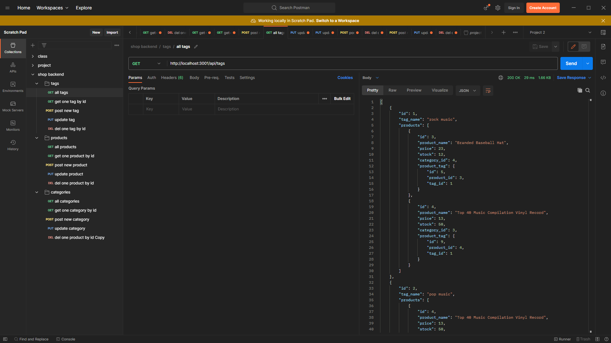

# shop-back-end

## Table of Contents
- [Issues](#issues)
- [Description](#description)
- [Installation](#installation)
- [Usage](#usage)
- [Screenshot](#screenshot)
- [License](#license)

## Issues
Associations can be confusing in general, and even more so if you forget to re-seed your database before you test a change. Don't make the same mistake I did, re-seed when making changes to your models/index.js

## Description
Using Sequelize, MySQL2, Dotenv, and Express this project is a skeleton of the structure you might find in the backend of an ecommerce site.

## Installation
Installations required: <br />
npm i

## Usage
In order to start you will need to
- Run the schema file.
- After running the Schema file, run ```node seeds/```
- Then you can run the server with ```npm start```

## Link
This app is completely serverside, and does not have a live deployment. If you wish to try it out I recommened you download [Postman](https://www.postman.com/) or [Insomnia](https://insomnia.rest/) or you could just make the calls through your browser too.

## Screenshot
Here is a screenshot of the application running. <br /> 

## Contact me
Here is my [GitHub Profile](https://github.com/reidmadock) <br />
- - -
## License
Distributed under the [None]() <br />
